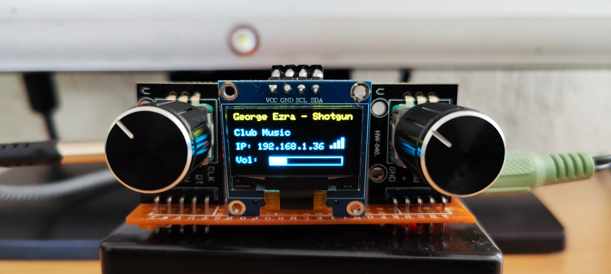
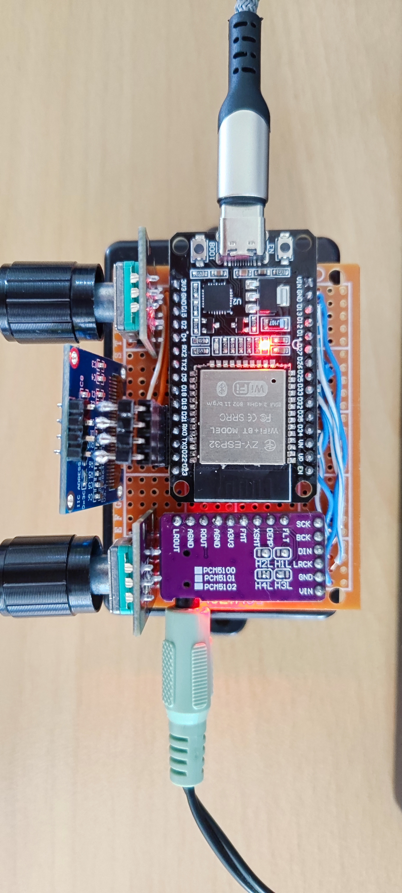

# ESP32 Web Radio with WebUI and Android App

Welcome to my ESP32-based Internet Radio project featuring a sleek Web Interface and optional Android app control.

---

## 🎛️ Hardware Setup

Here’s a look at my device:

  
*Front view of the ESP32 radio device*

  
*Back view showing the PSU and connectors*

---

## 🚀 Project Overview

This project transforms the **ESP32** into a powerful Internet Radio streaming MP3 channels, controllable via a responsive web UI or Android app.

**Key Features:**

- 🎵 **Internet Radio Streaming** (MP3 format)  
- 🌐 **Responsive Web Interface** for station selection, volume control, and streaming status  
- 📲 **Android App API compatibility** for remote control  
- 🖥️ **SSD1306 OLED Display** showing:  
  - Station name  
  - Metadata (stream title)  
  - Wi-Fi status and signal strength  
- 🔊 **PCM5102A I2S DAC** for high-quality audio output  
- ⚡ **Battery powered** using LX-2B UPS module and 2×18650 batteries  

---

## 🛠️ Hardware Components

| Component                    | Description                                   |
|-----------------------------|-----------------------------------------------|
| **ESP32-D0WD-V3 (rev 3.1)** | Dual-core 240 MHz Wi-Fi & Bluetooth SoC       |
| **SSD1306 OLED 128×64**      | Monochrome OLED display for info & status     |
| **PCM5102A DAC**             | High-fidelity digital audio to analog output  |
| **LX-2B UPS Module**         | Uninterruptible power supply with battery management |
| **2×18650 Lithium Batteries**| Rechargeable battery pack powering the system|

---
